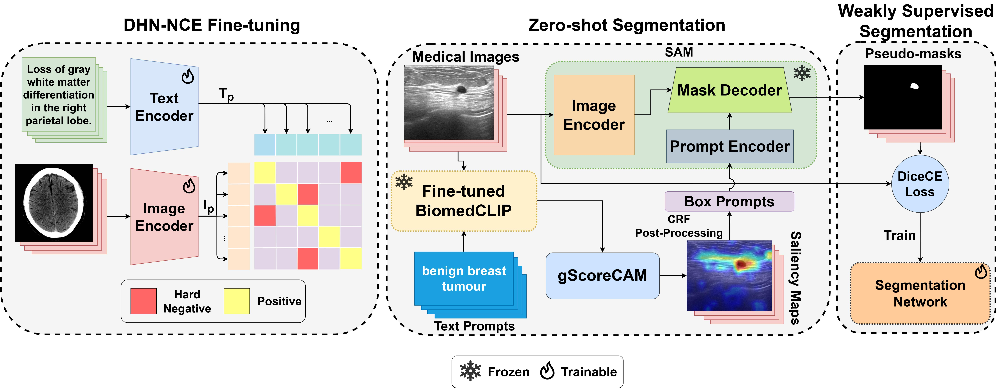
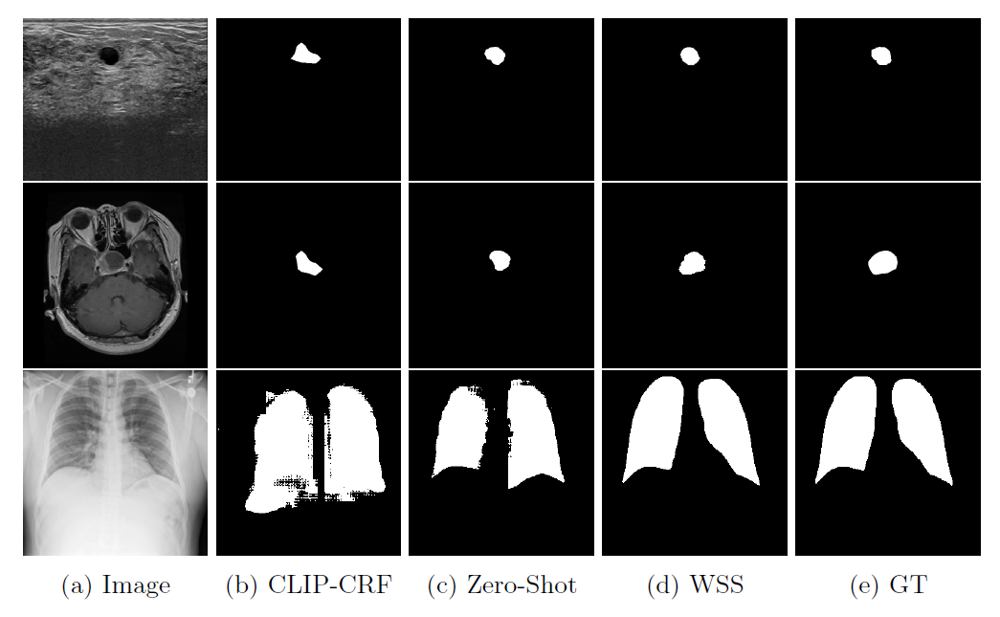

# MedCLIP-SAM

**[Health-X Lab](http://www.healthx-lab.ca/)** | **[IMPACT Lab](https://users.encs.concordia.ca/~impact/)** 

[Taha Koleilat](https://scholar.google.com/citations?user=chB2OjUAAAAJ&hl=en), [Hojat Asgariandehkordi](https://scholar.google.com/citations?user=ndXNye4AAAAJ&hl=en), [Hassan Rivaz](https://users.encs.concordia.ca/~hrivaz/), [Yiming Xiao](https://yimingxiao.weebly.com/curriculum-vitae.html)

[[`Paper`](https://arxiv.org/abs/2403.20253)] [[`Overview`](#overview)] [[`Datasets`](#datasets)] [[`Demo`](#colab-demo)] [[`BibTeX`](#citing-medclip-sam)]

## Overview

_**Abstract:** Medical image segmentation of anatomical structures and pathology is crucial in modern clinical diagnosis, disease study, and treatment planning. To date, great progress has been made in deep learning-based segmentation techniques, but most methods still lack data efficiency, generalizability, and interactability. Consequently, the development of new, precise segmentation methods that demand fewer labeled datasets is of utmost importance in medical image analysis. Recently, the emergence of foundation models, such as CLIP and Segment-Anything-Model (SAM), with comprehensive cross-domain representation opened the door for interactive and universal image segmentation. However, exploration of these models for data-efficient medical image segmentation is still limited, but is highly necessary. In this paper, we propose a novel framework, called MedCLIP-SAM that combines CLIP and SAM models to generate segmentation of clinical scans using text prompts in both zero-shot and weakly supervised settings. To achieve this, we employed a new Decoupled Hard Negative Noise Contrastive Estimation (DHN-NCE) loss to fine-tune the BiomedCLIP model and the recent gScoreCAM to generate prompts to obtain segmentation masks from SAM in a zero-shot setting. Additionally, we explored the use of zero-shot segmentation labels in a weakly supervised paradigm to improve the segmentation quality further. By extensively testing three diverse segmentation tasks and medical image modalities (breast tumor ultrasound, brain tumor MRI, and lung X-ray), our proposed framework has demonstrated excellent accuracy._

### Framework

<p float="left">
  
</p>

### Sample Segmentation Results
<p float="left">
  
</p>

## Datasets
- [Radiology Objects in COntext (ROCO)](https://github.com/razorx89/roco-dataset)
- [MedPix](https://drive.google.com/file/d/1qY_LLYRM7akV50_wOn-ItNKU5rGpfjya/view?usp=drive_link)
- [Breast UltraSound Images (BUSI)](https://www.kaggle.com/datasets/aryashah2k/breast-ultrasound-images-dataset)
- [COVID-QU-Ex](https://www.kaggle.com/datasets/anasmohammedtahir/covidqu)
- [Brain Tumors](https://www.kaggle.com/datasets/ashkhagan/figshare-brain-tumor-dataset)

## Colab Demo

Interactive Colab demo: [](https://colab.research.google.com/drive/13BRR5eiOE0zIrdc9Fy6uFciJ6l13PVg8?usp=sharing)

## Prerequisites & Installation
Install annconda following the [anaconda installation documentation](https://docs.anaconda.com/anaconda/install/).
Create an enviroment with all required packages with the following command :
```bashscript
conda env create -f medclipsam_env.yml
```
then setup the segment-anything library:
```bashscript
cd segment-anything
pip install -e .
cd ..
```
download model checkpoints for SAM and place them in the segment-anything directory

### <a name="Models"></a>SAM Model Checkpoints

Three model versions of the SAM model are available with different backbone sizes. These models can be instantiated by running

Click the links below to download the checkpoint for the corresponding model type.

- `vit_h`: [ViT-H SAM model.](https://dl.fbaipublicfiles.com/segment_anything/sam_vit_h_4b8939.pth)
- `vit_l`: [ViT-L SAM model.](https://dl.fbaipublicfiles.com/segment_anything/sam_vit_l_0b3195.pth)
- **`default` or `vit_b`: [ViT-B SAM model.](https://dl.fbaipublicfiles.com/segment_anything/sam_vit_b_01ec64.pth)**

finally create a directory for your data that you want to work with in the main working directory

## How to run
### Step 1: Generate Saliency Maps
```bashscript
python saliency_maps/visualize_cam.py --cam-version gscorecam --image-folder <path/to/data/dir> --model-domain biomedclip --save-folder <path/to/save/dir>
```
you can also input a different text prompt for each image one by one:
```bashscript
python saliency_maps/visualize_cam.py --cam-version gscorecam --image-folder <path/to/data/dir> --model-domain biomedclip --save-folder <path/to/save/dir> --one-by-one
```
### Step 2: Post-process using CRF
```bashscript
python crf/densecrf_sal.py --input-path <path/to/data/dir> --sal-path <path/to/saliency/maps> --output-path <path/to/output/dir>
```
you can also change the CRF settings:
```bashscript
python crf/densecrf_sal.py --input-path <path/to/data/dir> --sal-path <path/to/saliency/maps> --output-path <path/to/output/dir> --gaussian-sxy <gsxy> --bilateral-sxy <bsxy> --bilateral-srgb <bsrgb> --epsilon <epsilon> --m <m> --tau <tau>
```
### Step 3: Prompt SAM using CRF Pseudo-masks
In our experiments, we used the ViT-B checkpoint: 
```bashscript
python segment-anything/prompt_sam.py --checkpoint <path/to/checkpoint> --model-type vit_b --input <path/to/data/dir> --output <path/to/output/dir> --mask-input <path/to/CRF/masks>
```
an option to do multi-contour evaluation is implemented:
```bashscript
python segment-anything/prompt_sam.py --checkpoint <path/to/checkpoint> --model-type vit_b --input <path/to/data/dir> --output <path/to/output/dir> --mask-input <path/to/CRF/masks> --multi-contour
```
### OPTIONAL: DHN-NCE Fine-tuning for better segmentation
You can optionally fine-tune the BiomedCLIP pre-trained model using our [DHN-NCE Loss](https://github.com/TahaKoleilat/MedCLIP-SAM/tree/main/loss)

## Acknowledgements

Special thanks to [open_clip](https://github.com/mlfoundations/open_clip), [gScoreCAM](https://github.com/anguyen8/gScoreCAM), [pydensecrf](https://github.com/lucasb-eyer/pydensecrf), and [segment-anything](https://github.com/facebookresearch/segment-anything) for making their valuable code publicly available.

## Citing MedCLIP-SAM

If you use MedCLIP-SAM, please consider citing:

    @article{koleilat2024medclip,
    title={MedCLIP-SAM: Bridging Text and Image Towards Universal Medical Image Segmentation},
    author={Koleilat, Taha and Asgariandehkordi, Hojat and Rivaz, Hassan and Xiao, Yiming},
    journal={arXiv preprint arXiv:2403.20253},
    year={2024}
    }
